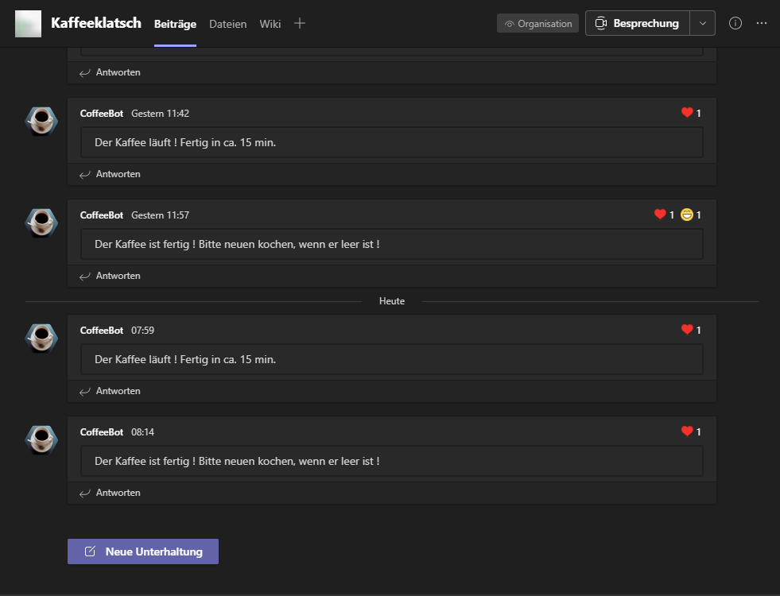
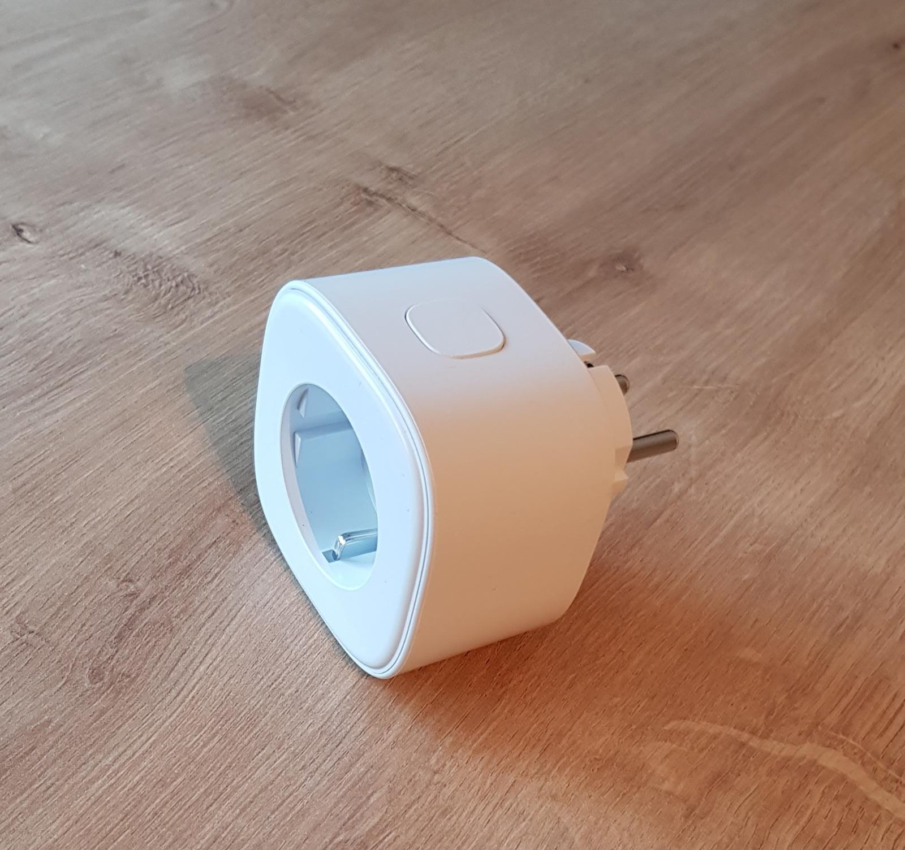
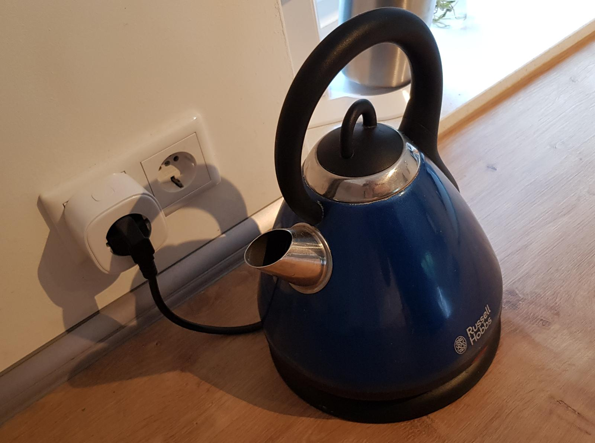

# Meross Teams Coffe

A cheap yet simple solution to get informed over a Microsoft Teams channel, when someone cooks coffee with a simple coffeemaker.

# Impressions

Stay up to date when someone cooks a coffee, be the first who get a fresh brew !



Cheap Wifi Smart Plug MSS310 from Meross, wich is measuring the current power consumption.



Yes i know, its not a coffeemaker, did not have one at home, but it follows the same principal, measure current power consumption, if it changes from 0 Watts to > 0 Watts make a message.



# Getting Started
## Dependencies / Requirements
- A coffeemaker (or other device you want to monitor wich has 0 W power consumption in off state and switching back to it after work is done)
- Meross MSS310 (feel free to extend with other Meross devices) https://www.meross.com/Detail/6/Smart%20Wi-Fi%20Plug%20with%20Energy%20Monitor
- Wifi with internet connection
- Smartphone (Meross App currently supports Android 4.1 or later and iOS 9 )
- Microsoft Teams
- A machine running Docker (or cloud with k8s)
- PostgreSQL DB (maybe also on Docker)

## Setup DB

Get yourself a PostgreSQL DB, or run one on docker.

````shell
docker run --name coffee_postgres -p 5432:5432 -e "TZ=GMT+2" -e POSTGRES_PASSWORD=coffee -e POSTGRES_DB=coffee -v ${PWD}/db_data:/var/lib/postgresql/data -d postgres
````

Connect to DB and setup the DDL

````postgresql
create table brews
(
	id serial not null
		constraint brews_pkey
			primary key,
	created_date timestamp not null,
	"startOrStop" boolean not null
);

alter table brews owner to postgres;
````

## Run

Test Local

```shell
docker run --rm -e MEROSS_EMAIL=example@gmail.com \
-e MEROSS_PASSWORD=StrongPw! \
-e TEAMS_WEBHOOK=https://webhook.site/c8966e4b-9072-4275-ab66-4c2bf12f60a2 \
-e MESSAGE_START=Test \
-e MESSAGE_END=Test2 itout/meross-teams-coffee:1.0.0
```

Server

```shell
docker run -it -e MEROSS_EMAIL=example@gmail.com \
-e MEROSS_PASSWORD=StrongPw! \
-e TEAMS_WEBHOOK=https://webhook.site/c8966e4b-9072-4275-ab66-4c2bf12f60a2 \
-e MESSAGE_START=Test \
-e MESSAGE_END=Test2 itout/meross-teams-coffee:1.0.0
```

## Environment Variables

| Variable  | Example |
|---|---|
|  MEROSS_EMAIL | example@gmail.com  |
| MEROSS_PASSWORD  | SuperStrong!  |
| MEROSS_DEVICE_NAME | Name of the Device set inside the Meross App, if there are multiple devices with the same, this app will use the first found  |
| TEAMS_WEBHOOK | https://webhook.site/c8966e4b-9072-4275-ab66-4c2bf12f60a2  |
| MESSAGE_START | Der Kaffee läuft ! Fertig in ca. 15 min. |
| MESSAGE_END | Der Kaffee ist fertig ! Bitte neuen kochen, wenn er leer ist ! |
| OS_WINDOWS | Set to 1 when running on Windows + Python 3.8 |

## Build for Devs

```shell
docker build -t docker.itout.de/iot/meross-teams-coffee:1.0.0 .
docker push docker.itout.de/iot/meross-teams-coffee:1.0.0
```

## Update DB for Devs
````shell
alembic upgrade head
````


## TODO's / Ideas

- Grafana Dashboard über die DB

Feel free to extend the list by adding issues.
Also feel free to extend.

## Build with
- https://github.com/albertogeniola/MerossIot